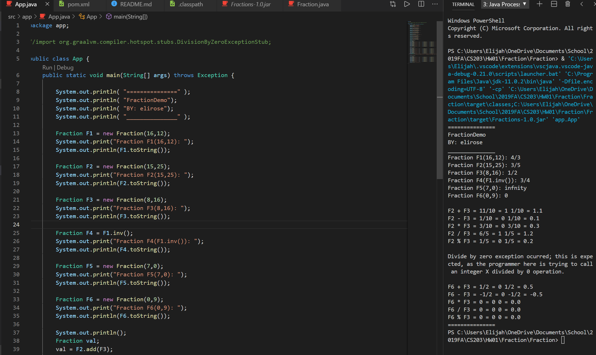

# HW01: Fractions
*[Elijah T.he Rose (elirose)](elirose@uab.edu)*

*CS203 - [Dr. Unan](unan@uab.edu) - FA2019*

This assignment seeks to model fractions in an Object-Oriented fashion via Java; see details in [HW01-assignment.pdf](HW01-assignment.pdf).

The project can be tested by running the [Fraction-1.0.jar](target/Fraction-1.0.jar) that is inside the `target` directiory with reference to the project (it is not fat). One can also likely run it like any standard eclipse project, considering that the directory structure mirrors that. The [App](src/app/App.java) class contains some general test cases demonstrating the functionality of the program, while the [Fraction](src/app/Fraction.java) class contains the actual methods and properties for this assignment. 

## Design Dificulties

### `getRemainder()` and `getQuotient()`
These two methods were... rather confusing. Its provided javadocs uses the same terminology as the other operator methods with "this/that", implying it will take a parameter, but is not provided with one. It also seems redundant, as the true quotient of one fraction and another would simply be a duplication of the `div()` method. As such, I took the liberty in assuming their intent: to get a mixed-number representation of a `Fraction` object. As such, as used here, the `getRemainder()` computes an integer amount of the fraction, and the `getQuotient()` returns the fractional part: in both these cases, this simply means restructuring the fraction such that the denominator is held constant while the numerator is made to be less than the denominator.

### `getRemainder()`: Int or Fraction?
The `getRemainder()` method returns the integer part of a mixed-number representation of the fraction. As such, it can be returned as an `int`. However, this may not be desired: if performing a series of operations with various fractions, suddenly having to construct a new `Fraction` object can be irritating. As such, the `getRemainder()` method returns a `Fraction` object much like the other functions, with the denominatorr of course being one. If someone needs the `int` result instead, they can either use `getRemainder().getNum()` or `getRemainderInt()`.

### Re-Use of Functions
As much as possible, I attempted to reuse other methods rather than create new code. While this runs the risk that if one method fails then several do, any respectable codebase has enough testing to ensure against such things. This condenses the code, allowing a DRY-er approach and allowing more succinct error-handling or extensions in the future. 

An exampe of this is the `div()` method:

```java
public Fraction div(Fraction that) { 
    return this.mul(that.inv());
} 
```

Note that it utilizes the fact that division operations are inherently multiplication operations with inversed dividends, rather than a more length 

```java
public Fraction div(Fraction that) { 
    return new Fraction((this.getNum()*that.getDenom()),(this.getDenom()*that.getNum()));
} 
```

Both return the same result. It could be argued that the second, more verbose example is more efficient as it does not have the additional overhead of the `mul()` and `inv()` methods, however the same could be said of many recursion functions.

## Running



You can see the project displaying the results of `App` on the right.# Number.Fraction

# Number.Fraction

